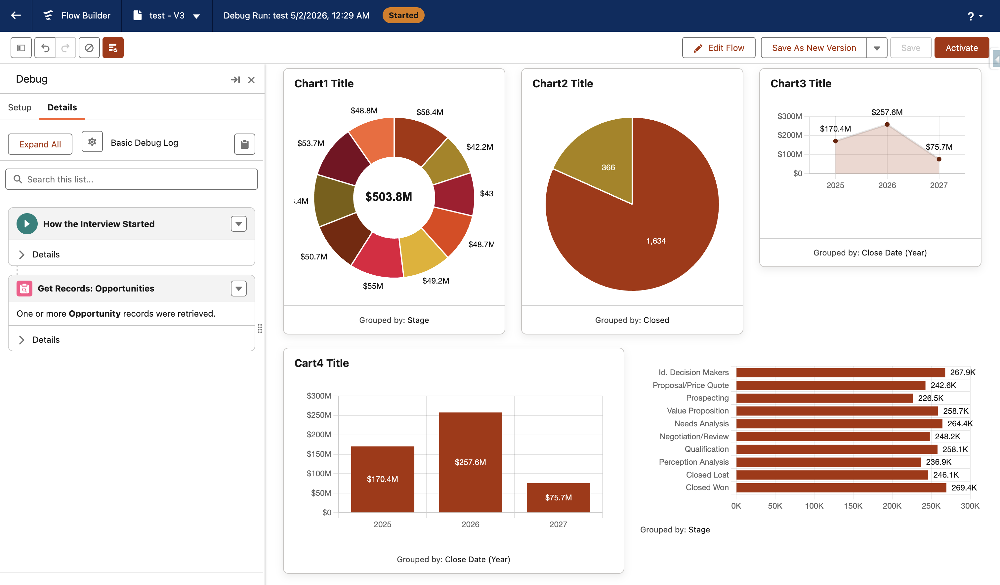

# Flow Tool Kit: Chart.js

**Add interactive charts to Flow Screens. No code.**

A Salesforce managed package that brings Chart.js into the Flow runtime as a screen component. Configure everything from the property editor — chart type, grouping, aggregation, colors, drilldown outputs — and chain the results into other components on the same screen.

> **Extension package** — this requires the [Flow Tool Kit](https://github.com/common-unite/Flow_Tool_Kit_Public) base package to be installed first. The Flow Tool Kit provides the shared property-editor framework and reactive plumbing this component depends on.

## What you get

- **5 chart types** — Bar (vertical / horizontal / stacked), Line, Area, Pie, Doughnut
- **Aggregate functions** — Count, Sum, Average, Min, Max — or detail mode (one point per record)
- **Group by anything** — Picklist, Reference, Date, DateTime, Boolean, Text. Reference fields show the related record name; picklists show translated labels; dates render as friendly labels (`Mar 2026`, `Q1 2026`, `Week 18, 2026`).
- **Click-to-drilldown** — every wedge click emits the underlying records, ready to feed a datatable, navigation, or another chart on the same screen
- **Top N** — optional Limit input caps the records the chart processes; combine with an upstream Sort for "Top 10 Accounts by Revenue" patterns
- **Per-grouping color mapping** — point-and-click UI for assigning a color to specific values; admins don't write JSON
- **Reactive** — the chart re-renders when its inputs change anywhere on the screen
- **Polished by default** — auto-contrast value labels, locale-aware number/date formatting, responsive layout, accessibility-friendly

## Install

1. Install the [Flow Tool Kit](https://github.com/common-unite/Flow_Tool_Kit_Public) base package.
2. Install the Chart.js extension via the package install link from your CCI release pipeline (or get it from your Salesforce admin).

## Quick start

1. **Drag** the **Form (Chart)** component onto a Flow Screen.
2. **Pick** an upstream record collection variable as the **Source Records**.
3. **Configure** chart type and field mapping. The SObject type auto-detects from your collection — every dropdown is filtered to fields on that object.
4. **Save and run.** Click any wedge to feed `selectedRecords`, `activeRecords`, etc. into other components.

→ Full walkthrough: [Quick Start](documents/QUICK_START.md)

## Documentation

- [Quick Start](documents/QUICK_START.md) — your first chart in five minutes
- [Property Editor Reference](documents/CPE_REFERENCE.md) — every field explained
- [Output Properties](documents/OUTPUTS.md) — what each output carries and how to bind it
- [Recipes](documents/RECIPES.md) — drilldown, multi-chart dashboards, branded colors, date comparisons
- [Performance](documents/PERFORMANCE.md) — guidance for large record collections

## Issues, roadmap, and feedback

- File bugs and request features in the **Issues** tab of this repo
- Track upcoming work in the **Projects** tab

## License

This package is distributed under its own license. The bundled open-source libraries (Chart.js, chartjs-plugin-datalabels, chartjs-adapter-date-fns) are MIT-licensed — see [Third-Party Notices](documents/THIRD_PARTY_NOTICES.md).
