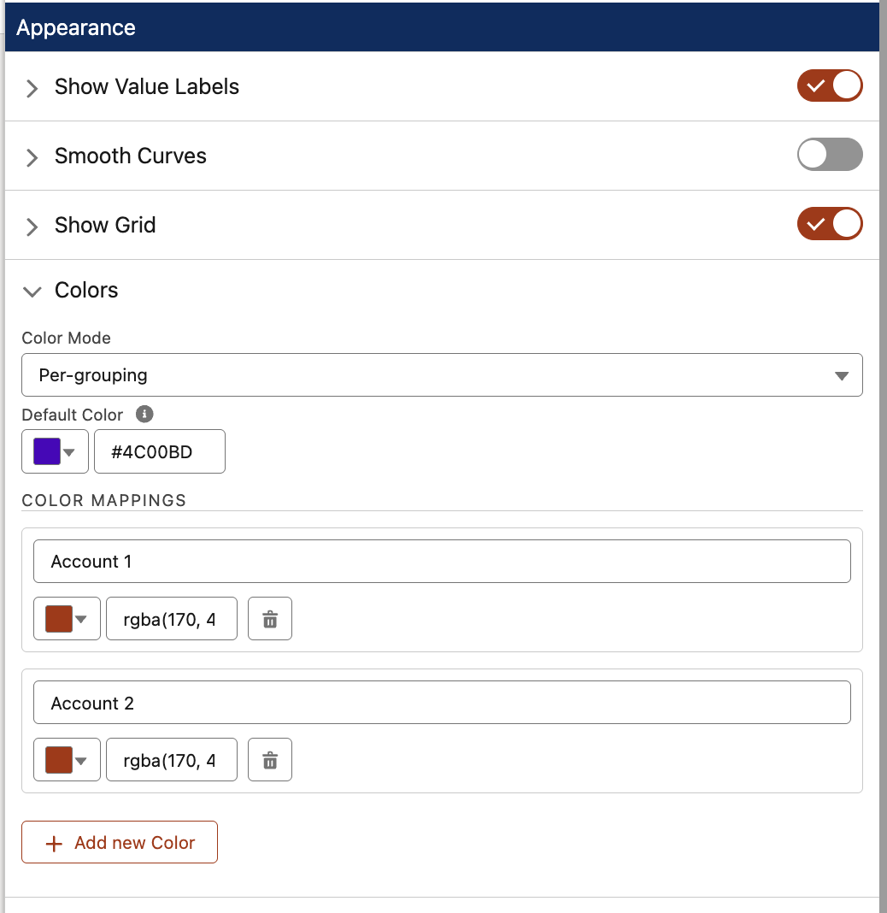

# Property Editor Reference

Every field in the **Form (Chart)** property editor, what it does, and when it appears.

The property editor mirrors the chart anatomy: **what data**, **how to summarize it**, **how it looks**. Fields appear and disappear based on context — for example, the Date Bucket picker only shows up when your Group By field is a Date or DateTime.

---

## Source Records

| Field | Description |
|---|---|
| **Source Records** | The Flow record collection to chart. The chart's SObject type is auto-detected from your selection. Every field dropdown below filters to fields on this object. |

---

## Chart Type

| Field | Description |
|---|---|
| **Chart Type** | Bar, Line, Area, Pie, or Doughnut. |
| **Orientation** *(Bar only)* | Vertical or Horizontal. Horizontal is useful when category labels are long. |

---

## Field Mapping

| Field | Description |
|---|---|
| **Aggregate Function** | `None` plots one point per record (detail mode). `Sum / Count / Average / Min / Max` group records by the Group By Field and compute a value per group. |
| **Labels Field** *(detail mode)* | Field whose value labels each point on the X-axis. Reference fields show the related record name; picklists show the translated label; dates render as the formatted date. |
| **Group By Field** *(aggregate mode)* | Each unique value of this field becomes its own bar / slice / point. Pick a Picklist, Reference, Date, Boolean, or text field. |
| **Date Bucket** *(when groupBy is Date / DateTime)* | How granular to make the date groups. Day, Week, Month, Quarter, or Year. |
| **Value Field (numeric)** *(when function is not Count)* | The numeric field to summarize. For example, `Amount` when summing Opportunity revenue. |
| **Limit** *(optional)* | Cap how many records the chart processes. Leave blank to use the entire collection. Combine with an upstream Sort for "Top N" patterns — e.g., Top 10 Accounts by Annual Revenue. Minimum value is 1. |

---

## Appearance

The Appearance section is an accordion — expand only what you need to configure.

### Show Legend *(Pie / Doughnut only)*

Toggle the slice legend on or off. When on, choose **Legend Position** (Top, Right, Bottom, Left).

### Show Value Labels

Toggle numeric labels directly on the chart elements (slice values, bar tops, line points).

| Field | Description |
|---|---|
| **Value Label Position** | **Top:** above the bar or outside the slice. **Center:** middle of the bar / slice. **Inside:** top edge of the bar or outer edge of the slice. |
| **Value Label Format** | Auto (detects from field type), Raw, Thousands (`50K`), Millions (`1.2M`), Currency, Percent. |

### Smooth Curves *(Line / Area only)*

Smooths line segments into a Bézier curve.

### Show Grid *(Bar / Line / Area only)*

Draws horizontal grid lines at axis ticks.

### Colors

| Field | Description |
|---|---|
| **Color Mode** | **Default** — uses the org's SLDS brand color. **Custom** — a single color you pick. **Per Grouping** — assign specific colors to specific values. |
| **Primary Color / Default Color** | The single color (Custom mode) or the fallback for unmapped values (Per Grouping mode). The label changes between modes. |
| **Color Mappings** *(Per Grouping mode)* | One row per mapping. Each row has the value and its color. Picklist Group By fields get a combobox of picklist labels; selected values are removed from the other rows' option lists so each picks a distinct value. Other field types get a plain text input — type the display label exactly as it appears on the chart (e.g., `Acme Corp`, `Aug 2025`, `Closed Won`). Unmapped values use the Default Color. |

### Container

| Field | Description |
|---|---|
| **Display Type** | **Card (with title)** wraps the chart in a Lightning card with a title and border. **Chart only** strips the card chrome but keeps the title and selection chip above the canvas. |
| **Chart Title** | Optional title shown above the chart. Bind to a Text variable for dynamic titles. Leave blank to hide. |
| **ARIA Label** | Screen-reader description. Auto-generated when blank. |

### Spacing

| Field | Description |
|---|---|
| **Vertical Margin** | Space above and below the chart, separating it from other Flow Screen components. SLDS spacing scale (none / xxx-small ... xx-large). |
| **Horizontal Margin** | Space to the left and right of the chart. Same scale. |

---

## Behavior (outputs)

The chart emits a set of output properties on click and on data change. See [Output Properties](OUTPUTS.md) for the full list and binding examples.
