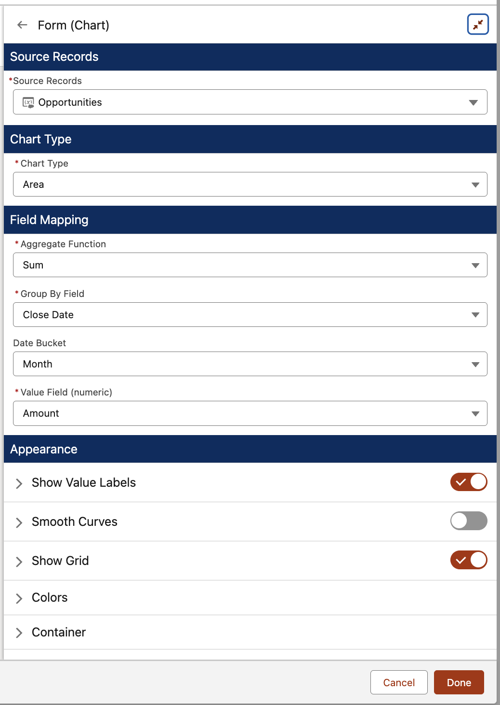
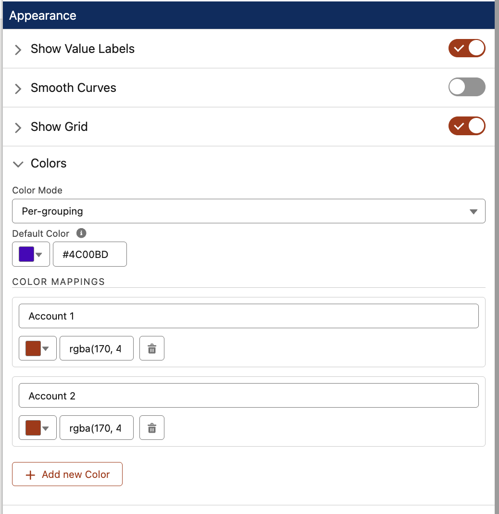
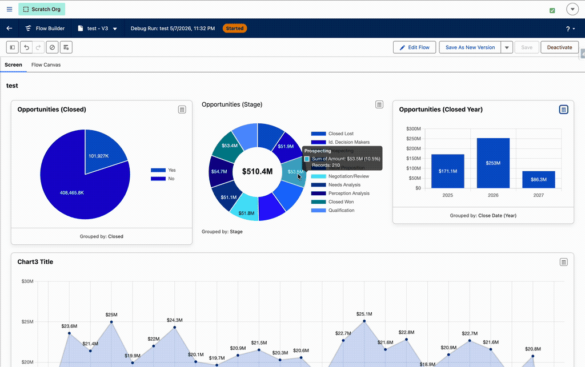
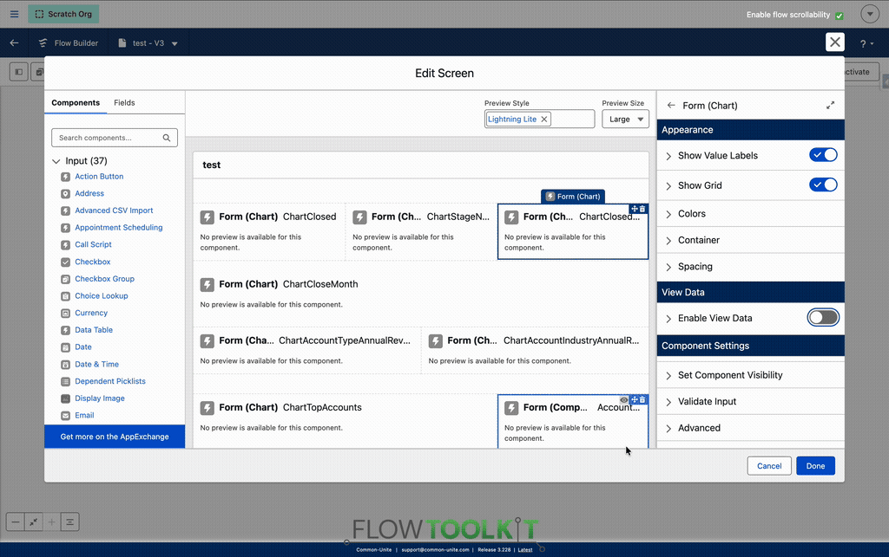

# Property Editor Reference

Every field in the **Form (Chart)** property editor, what it does, and when it appears.

The property editor mirrors the chart anatomy: **what data**, **how to summarize it**, **how it looks**. Fields appear and disappear based on context - for example, the Date Bucket picker only shows up when your Group By field is a Date or DateTime.

---

## Source Records

| Field | Description |
|---|---|
| **Source Records** | The Flow record collection to chart. The chart's SObject type is auto-detected from your selection. Every field dropdown below filters to fields on this object. |

---

## Chart Type

| Field | Description |
|---|---|
| **Chart Type** | Bar, Line, Area, Pie, Doughnut, or Timeline (Gantt). |
| **Orientation** *(Bar only)* | Vertical or Horizontal. Horizontal is useful when category labels are long. |
| **Density** *(Timeline only)* | Comfortable or Compact. Compact renders thinner pill bars and tighter rows. |

---

## Field Mapping

| Field | Description |
|---|---|
| **Aggregate Function** | `None` plots one point per record (detail mode). `Sum / Count / Average / Min / Max` group records by the Group By Field and compute a value per group. |
| **Labels Field** *(detail mode)* | Field whose value labels each point on the X-axis. Reference fields show the related record name; picklists show the translated label; dates render as the formatted date. |
| **Group By Field** *(aggregate mode)* | Each unique value of this field becomes its own bar / slice / point. Pick a Picklist, Reference, Date, Boolean, or text field. |
| **Date Bucket** *(when groupBy is Date / DateTime)* | How granular to make the date groups. Day, Week, Month, Quarter, or Year. |
| **Value Field (numeric)** *(when function is not Count)* | The numeric field to summarize. For example, `Amount` when summing Opportunity revenue. |
| **Limit** *(optional)* | Cap how many records the chart processes. Leave blank to use the entire collection. Combine with an upstream Sort for "Top N" patterns - e.g., Top 10 Accounts by Annual Revenue. Minimum value is 1. |

### Field Mapping - Timeline (Gantt)

When Chart Type is **Timeline (Gantt)**, the aggregate fields above are replaced by timeline mapping, grouped into an accordion. Full guide with per-parameter considerations and recipe combinations: [Timeline (Gantt)](TIMELINE_GANTT.md).

**Rows and Grouping**

| Field | Description |
|---|---|
| **Row Label Field** | One row per record, labeled by this field. Leave on *None* together with a Group By Field to get one row per group with the records as milestone diamonds. |
| **Group By Field** | With a Row Label Field: bold swimlane headers above each group's rows. Without one: each group becomes a single row. Lookups (including custom) resolve to record names. |

**Bar Dates**

| Field | Description |
|---|---|
| **Start Date Field** | Where each record's bar begins. A record with a blank value automatically starts where the previous record in its group ended (collection order); explicit start dates always win. |
| **End Date Field** | Where each record's bar ends. End-dates-only data is a valid configuration - starts chain. |
| **Default Start Date** | Flow-bindable fallback for missing starts, and the chain anchor for each group's first record (e.g., a grant award date). |
| **Default End Date** | Flow-bindable fallback for records with no end date. |

**Milestones**

| Field | Description |
|---|---|
| **Milestone Date Field** | Date/Datetime field rendered as a diamond per record - e.g., a Requirement's due date. |
| **End Date Markers** *(when Start/End set)* | A diamond at the end of every bar, colored like its bar. |

**Color and Progress**

| Field | Description |
|---|---|
| **Color By Field** | Picklist / text / checkbox field that drives bar and diamond colors. Per-value color mappings key off this field. |
| **Progress Field** | Percent field (0-100) that fills each bar proportionally in the full-strength color. |

**Axis and Tooltips**

| Field | Description |
|---|---|
| **Axis Scale** | Time-axis tick granularity: Auto (from data span), Week, Month, Quarter, Year. |
| **Tooltip Fields** | Comma-separated field API names appended as extra hover-tooltip lines (e.g., `Description, Amount`). Long values wrap. |

---

## Appearance

The Appearance section is an accordion - expand only what you need to configure.

### Show Legend *(Pie / Doughnut / Timeline)*

Toggle the legend on or off. Pie/Doughnut legends each slice and offer a **Legend Position** picker (Top, Right, Bottom, Left). Timeline legends the Color By values as chips above the canvas - squares for bar colors, diamonds for milestone colors - with a fixed position.

### Show Value Labels

Toggle numeric labels directly on the chart elements (slice values, bar tops, line points).

| Field | Description |
|---|---|
| **Value Label Position** | **Top:** above the bar or outside the slice. **Center:** middle of the bar / slice. **Inside:** top edge of the bar or outer edge of the slice. |
| **Value Label Format** | Auto (detects from field type), Raw, Thousands (`50K`), Millions (`1.2M`), Currency, Percent. |

### Smooth Curves *(Line / Area only)*

Smooths line segments into a Bézier curve.

### Today Line *(Timeline only)*

Dashed vertical marker at the current date, labeled "Today." On by default; the time axis extends to include today when enabled.

### End Date Markers *(Timeline only, with Start/End set)*

Adds a diamond at the end of every date-range bar, colored like its bar.

### Show Grid *(Bar / Line / Area only)*

Draws horizontal grid lines at axis ticks.

### Colors

| Field | Description |
|---|---|
| **Color Mode** | **Default** - uses the org's SLDS brand color. **Custom** - a single color you pick. **Per Grouping** - assign specific colors to specific values. |
| **Primary Color / Default Color** | The single color (Custom mode) or the fallback for unmapped values (Per Grouping mode). The label changes between modes. |
| **Color Mappings** *(Per Grouping mode)* | One row per mapping. Each row has the value and its color. Picklist fields get a combobox of picklist labels; selected values are removed from the other rows' option lists so each picks a distinct value. Other field types get a plain text input - type the display label exactly as it appears on the chart (e.g., `Acme Corp`, `Aug 2025`, `Closed Won`). Unmapped values use the Default Color. For Timeline charts, mappings key off the **Color By Field** instead of the Group By Field. |

### Container

| Field | Description |
|---|---|
| **Display Type** | **Card (with title)** wraps the chart in a Lightning card with a title and border. **Chart only** strips the card chrome but keeps the title and selection chip above the canvas. |
| **Chart Title** | Optional title shown above the chart. Bind to a Text variable for dynamic titles. Leave blank to hide. |
| **ARIA Label** | Screen-reader description. Auto-generated when blank. |

### Spacing

| Field | Description |
|---|---|
| **Vertical Margin** | Space above and below the chart, separating it from other Flow Screen components. SLDS spacing scale (none / xxx-small ... xx-large). |
| **Horizontal Margin** | Space to the left and right of the chart. Same scale. |

---

## View Data

Surface the records behind the chart in an on-demand modal hosted by the FlowToolKit Form Builder data table. Phase 1 is **display-only** - the modal renders the records currently active on the chart at click time (snapshot), with search/filter on. The chart and rest of the screen are non-interactive while the modal is open.

> **Licensing note** - the View Data modal embeds the FlowToolKit data-table component. The chart component itself is free to use, but the **data-table component is subject to paid Flow Tool Kit subscriptions** for most objects. The free Flow Tool Kit tier supports tables on **Account, Contact, Case, and Lead** only. To enable View Data on any other object, your org needs a paid Flow Tool Kit license. Your existing chart will continue to render fine without View Data - this only affects the modal.

| Field | Description |
|---|---|
| **Enable View Data** | Toggle that adds a small `utility:table` icon-button to the chart's header (top-right). The button is always visible when this is on; if no Form is configured, it renders disabled with an explanatory tooltip. |
| **View Data Form** | Picker for the FlowToolKit Form Builder *table* that drives the column layout. The picker is filtered to the chart's auto-detected sObject and only shows Forms whose type is `table` (regular form components are excluded - the modal hosts a data table). |

**What admins can rely on**:
- The modal opens at the largest stock `lightning/modal` size (`large`).
- The data table receives a deep-cloned snapshot of `activeRecords` (which collapses to selected records when a chart wedge is selected, otherwise visible records).
- Search/filter is auto-enabled. The action column is hidden - Phase 1 is read-only.
- Closing the modal (X button, ESC, backdrop click, or "Close / Return") returns focus to the trigger.

**Phase 2 follow-ups** (not in scope today): row selection flowing back as a chart output, write-back collections (insert/update/delete), live updates while the modal is open, admin-tunable button label and modal size.

---

## Record Form on Click

Clicking a chart element that represents **exactly one record** - a timeline milestone diamond, a row-per-record timeline bar, or any detail-mode element - opens that record in a FlowToolKit **Form** modal. Group-level elements (aggregate bars/slices, timeline period bars, swimlane headers) stay selection-only.

Editing follows the family's no-DML contract: Save closes the modal, the chart re-renders with the edited values, and the records flow out through `updateCollection` / `hasRecordsForUpdate` for **your Flow** to save - see [Output Properties](OUTPUTS.md). Cancel or Save both deselect the clicked element.

> **Licensing note** - the modal embeds the FlowToolKit Form component, which is subject to the same paid Flow Tool Kit tiers as the data table: the free tier supports **Account, Contact, Case, and Lead** only. Charts render fine without this feature on any object.

| Field | Description |
|---|---|
| **Record Form on Click** | The enable toggle. Off by default. |
| **Form Selection Mode** | **Component** - one Form for every record, picked from the selector. **Record Field** - pick a text/formula field on the source record whose *value* is the Form's qualified API name; every record can open its own layout, and records with a blank value stay selection-only. **Custom** - build an inline JSON form unique to this chart, no Form record required. |

The value slot is auto-detected at runtime (Form name vs. JSON config), matching the flowForm component's behavior.

---

## Behavior (outputs)

The chart emits a set of output properties on click and on data change. See [Output Properties](OUTPUTS.md) for the full list and binding examples.
