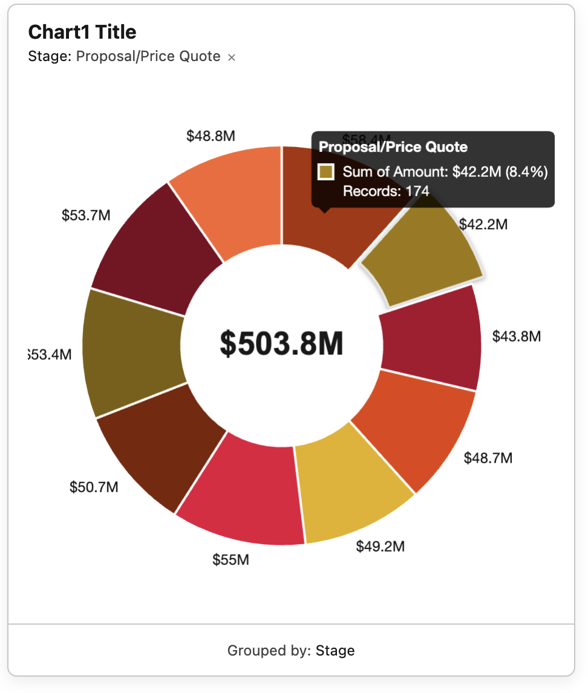

# Output Properties

**This is the heart of the component.** The chart isn't just for display — every click, every data change, and every legend toggle emits a set of outputs that other components on the same Flow Screen can react to. A chart wired up correctly turns into a filter, a navigator, or a master record picker for the rest of the page.

## The big idea

Every chart maintains three streams of records:

| Stream | What it represents | Best for |
|---|---|---|
| **Selected** | The records that compose the wedge / bar the user clicked. Empty when nothing is selected. | "Show me only the records the user clicked on." |
| **Visible** | All records currently rendered on the chart. Updates when the source collection changes or a slice is hidden via legend toggle. | "Always show me what the chart is displaying." |
| **Active** | **Selected when something is selected, otherwise Visible.** A unified stream that swaps based on context. | **The right default for most downstream components.** |

Think of **Active** as "what the user is looking at right now." On initial load the user is looking at every record (active = visible). Click a wedge and they're looking at one group (active = selected). Click again to deselect and they're back to all visible.

## All outputs at a glance

### Selected (12 outputs)

| Output | Type | What it carries |
|---|---|---|
| `selectedRecords` | Record Collection | Records in the clicked element |
| `selectedRecordIds` | List of Text | Their Ids |
| `selectedRecordCount` | Integer | How many records are selected |
| `firstSelectedRecord` | Single record | First record in the selection — for navigating to a single record |
| `firstSelectedRecordId` | Text | Id of the first selected record |
| `selectedDataSetLabel` | Text | The dataset name like `Sum of Amount` or `Count` |
| `selectedGroupLabel` | Text | Label of the clicked element like `Closed Won` or `Mar 2026` |
| `selectedDataValue` | Number | The numeric value at the clicked point |
| `selectedPercent` | Number | Selected value as a percent of total (one decimal) |

### Visible (3 outputs)

| Output | Type | What it carries |
|---|---|---|
| `visibleRecords` | Record Collection | Records currently rendered on the chart |
| `visibleRecordIds` | List of Text | Their Ids |
| `visibleRecordCount` | Integer | How many records are showing |

### Active (3 outputs) — *recommended default*

| Output | Type | What it carries |
|---|---|---|
| `activeRecords` | Record Collection | Selected when something is selected, otherwise Visible |
| `activeRecordIds` | List of Text | Their Ids |
| `activeRecordCount` | Integer | How many active records there are |

---

## Wiring outputs into other components

Drag a **second component** onto the same Flow Screen — typically a datatable, a related list, or another **Form (Chart)** — and bind its input to one of the chart's outputs.

### Example 1 — Chart drives a datatable

A doughnut on the left, a Lightning datatable on the right. The datatable shows records that compose whatever the user is currently looking at:

| Datatable input | Bind to |
|---|---|
| `keyField` | `Id` |
| `tableData` | `{!Form_Chart_1.activeRecords}` |

Now the datatable is full on initial render (because Active = Visible), and the moment the user clicks a wedge, it filters to that group's records. Click off the wedge and it goes back to showing everything.

### Example 2 — Chart drives a record form

A bar chart of Opportunities by Stage. When the user clicks a bar, you want to display the most-recent Opportunity in that group as a form below the chart. Bind a record form's `recordId` to `{!Form_Chart_1.firstSelectedRecordId}`. (Make sure the upstream Get Records sorts by `LastModifiedDate DESC` so "first" means "most recent.")

### Example 3 — Header that updates with the click

A Display Text component above the chart bound to `{!Form_Chart_1.selectedGroupLabel}` and `{!Form_Chart_1.selectedRecordCount}`:

> **You picked {!selectedGroupLabel}** — {!selectedRecordCount} records, {!selectedPercent}% of total.

### Example 4 — Chart drives another chart

Two charts on the same screen — a high-level summary (e.g., Sum of Amount by Stage) and a detail breakdown (e.g., Sum of Amount by Owner). Bind the second chart's `Source Records` input to `{!Form_Chart_1.activeRecords}`. The detail chart now drills automatically when the user clicks a stage in the summary.

---

## Pass data IN — try the screen action / reactive pattern

The chart is a **reactive** Screen component. Inputs read from Flow variables update the chart live without leaving the screen. This is the same magic that powers screen-action and reactive-component features on Flow Screens.

A few patterns worth experimenting with:

- **Filter dropdown drives the chart.** Add a Picklist or Choice component above the chart. Use a Decision or Assignment to filter the source collection into a new variable, then bind the chart's `Source Records` to that variable. Picking a filter value re-renders the chart instantly.
- **Toggle Aggregate Function from a Choice.** Bind the chart's `Aggregate Function` input to a Choice component (`Sum` / `Count` / `Average`). The chart switches modes live as the user picks.
- **Toggle the Group By field with reactive binding.** A choice of "By Stage / By Owner / By Industry" can drive `Group By Field` directly. The chart pivots without a screen reload.
- **Date filter pipes into the chart.** A date input bound to a screen variable, that variable feeding a downstream Get Records, that Get Records' output feeding the chart. The whole chain re-runs on every date change.

This kind of in-place reactivity is one of the most powerful (and underused) parts of Flow Screens — and the chart was designed for it. Try wiring a small filter UI above the chart on your first project; it lifts the chart from a static visualization to a live exploration tool.
