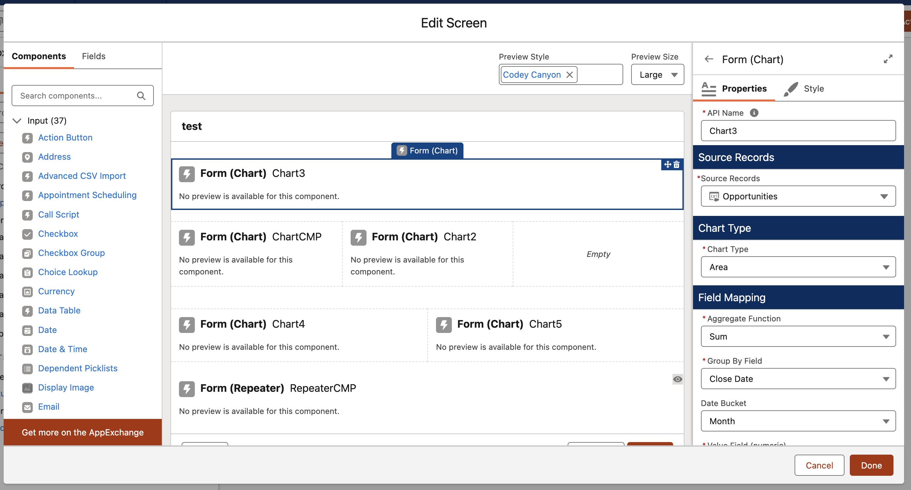
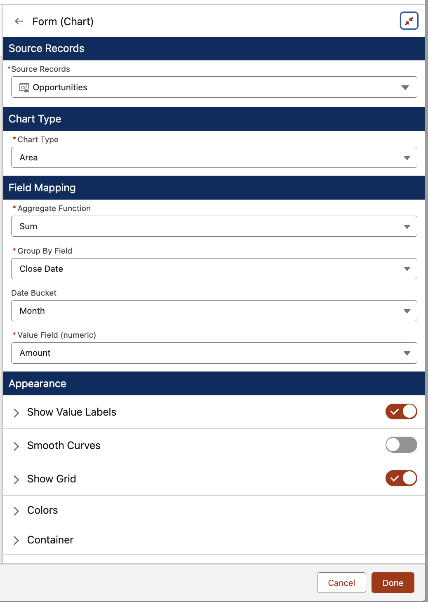
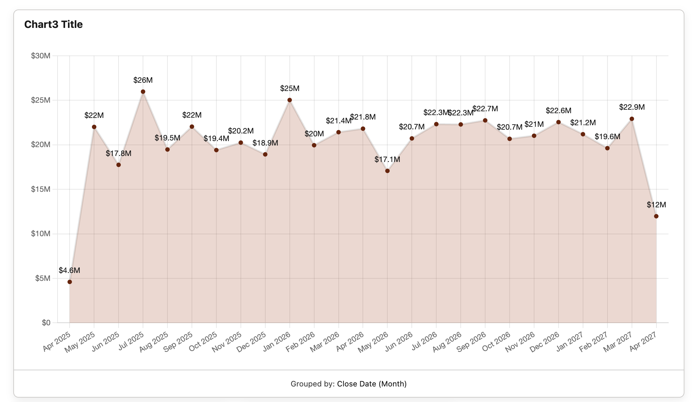

# Quick Start

Build your first chart in under five minutes.

## Prerequisites

- The [Flow Tool Kit](https://github.com/common-unite/Flow_Tool_Kit_Public) base package installed in your org (this Chart.js component is an extension package that depends on it).
- **Flow Tool Kit: Chart.js** installed in your org — see the [latest release](https://github.com/common-unite/flowtoolkit_chart_js_Public/releases/latest) for the most current install URL and changelog. Direct install links for the current production release (**0.4.0.1**):
  - Sandbox / Scratch: [test.salesforce.com install link](https://test.salesforce.com/packaging/installPackage.apexp?p0=04tRQ0000009LbVYAU)
  - Production / DE: [login.salesforce.com install link](https://login.salesforce.com/packaging/installPackage.apexp?p0=04tRQ0000009LbVYAU)
- A Flow with a record collection variable (from a Get Records, an SOQL, or an upstream subflow).

## 1. Drop the component on a screen

In Flow Builder, open or create a Screen element. In the **Components** panel on the left, search for **Form (Chart)** and drag it onto the screen.

## 2. Pick your source records

In the property editor on the right, select your record collection variable in the **Source Records** dropdown. The chart's SObject type auto-detects — every field dropdown below is filtered to fields on that object.

## 3. Configure the chart

Three things to decide:

| Field | What it does |
|---|---|
| **Chart Type** | Bar, Line, Area, Pie, or Doughnut |
| **Aggregate Function** | `None` plots one point per record. `Sum / Count / Average / Min / Max` group records and compute a value per group. |
| **Group By Field** *(aggregate only)* | The field whose unique values become bars / slices |
| **Value Field** *(when not Count)* | The numeric field to summarize |

For a date Group By, an extra **Date Bucket** picker appears — choose Day, Week, Month, Quarter, or Year.

## 4. Save and run

Save the Flow and run it. The chart renders against your live data.

## What's next

- Make wedge clicks drive other components — see [Output Properties](OUTPUTS.md) and the [Drilldown recipe](RECIPES.md#drilldown).
- Customize colors per value — see [Per-grouping colors](RECIPES.md#per-grouping-colors).
- Build a multi-chart dashboard — see [Multi-chart dashboard](RECIPES.md#multi-chart-dashboard).
- Let users **inspect the records behind the chart** in a modal — see [View Data](CPE_REFERENCE.md#view-data).
- For every property editor field, see the [Property Editor Reference](CPE_REFERENCE.md).
