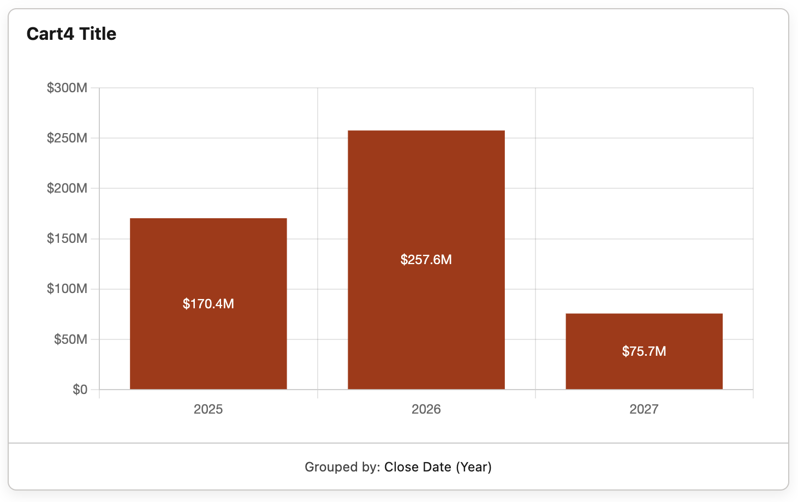
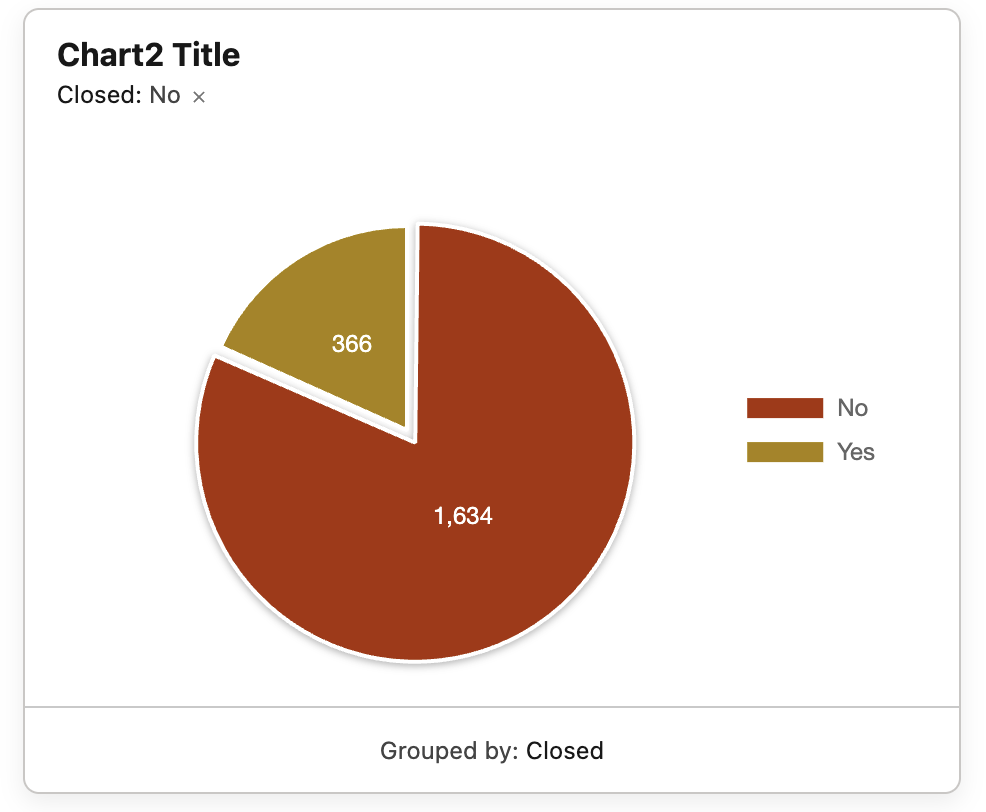
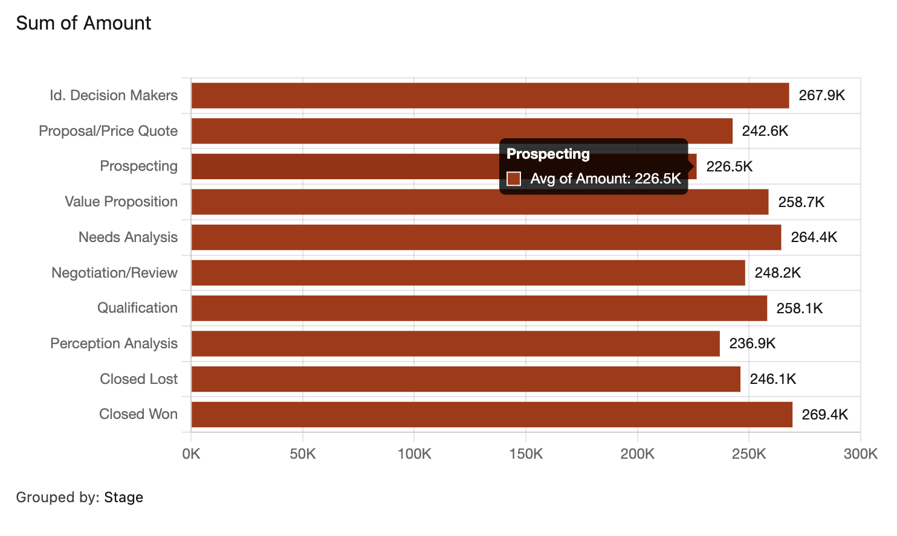

# Recipes

Patterns for getting the most out of the Form (Chart) component.

## Drilldown

The chart's outputs are designed to feed downstream Screen components. Drop a chart and a datatable side-by-side on the same Screen, bind the datatable's records input to the chart's `activeRecords` output, and you have a working drilldown — the table updates live as the user clicks wedges.

| Where | Bind to |
|---|---|
| Datatable `tableData` | `{!Form_Chart_1.activeRecords}` |
| Datatable `keyField` | `Id` |

`activeRecords` is the right output for this — it shows visible records on initial load and swaps to selected records once the user clicks a wedge. See [Output Properties](OUTPUTS.md) for the full list.

---

## Multi-chart dashboard

Drop multiple **Form (Chart)** components on the same Screen, all reading from the same source collection. Each can render a different view of the same data.

The example above shows four charts off the same Opportunities collection:

- **Doughnut** — Sum of Amount by Stage (with center total)
- **Pie** — Count by Closed (Boolean — Yes / No)
- **Area** — Sum of Amount by Close Date (Year)
- **Horizontal Bar** — Avg of Amount by Stage

Tip: chain them. Click a wedge in the doughnut to filter what the bar chart shows by binding the bar's `Source Records` to the doughnut's `activeRecords`.

---

## Per-grouping colors

When the chart is grouped by a field where specific values map to specific brand colors (e.g., Stage = Closed Won is green, Closed Lost is red), use **Color Mode → Per Grouping**. The mapping UI is point-and-click — no JSON.

Picklist Group By fields get a combobox of picklist labels — once a value is mapped in one row, it's removed from the other rows' option lists. For other field types (Reference, Date, String, Boolean), type the display label exactly as it appears on the chart axis. Unmapped values fall back to the **Default Color**.

---

## Date bucket comparison

Build three charts on the same Screen, all grouped by the same Date field, with different **Date Bucket** settings — Year, Quarter, and Month. Same data, three time-grain views.

Date bucket labels render as friendly formats (`2026`, `Q1 2026`, `Mar 2026`, `Week 18, 2026`, `May 1`) using the running user's locale.

---

## Boolean Yes / No

Group a chart by a Boolean field (e.g., `IsClosed`, `IsDeleted`) and the bars / slices automatically render with **Yes** and **No** labels. The chart also handles Salesforce's quirk where false-valued Boolean fields can be omitted from record JSON — those records are correctly counted under No instead of falling into a `(No value)` bucket.

---

## Horizontal bar with tooltip

For long category labels (Account names, picklist values with long display labels), switch the bar chart's Orientation to **Horizontal**. Labels render to the left of each bar and don't get truncated.

The tooltip on hover shows the full data point even when the value labels would otherwise truncate.
