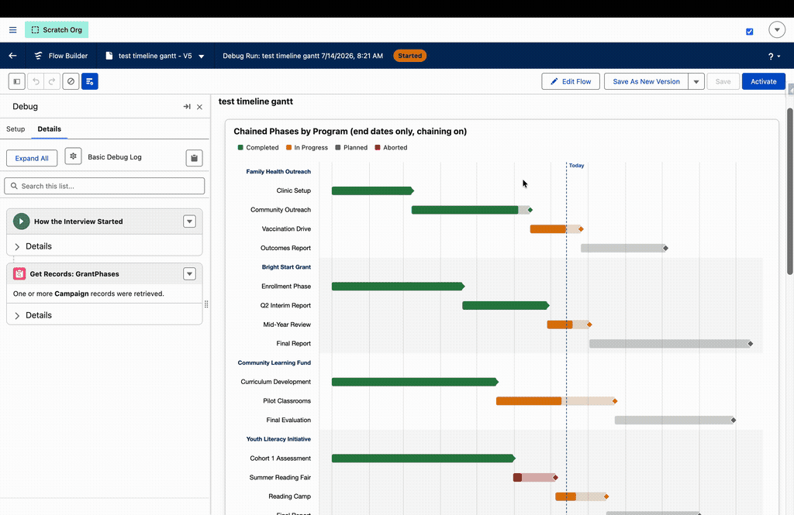
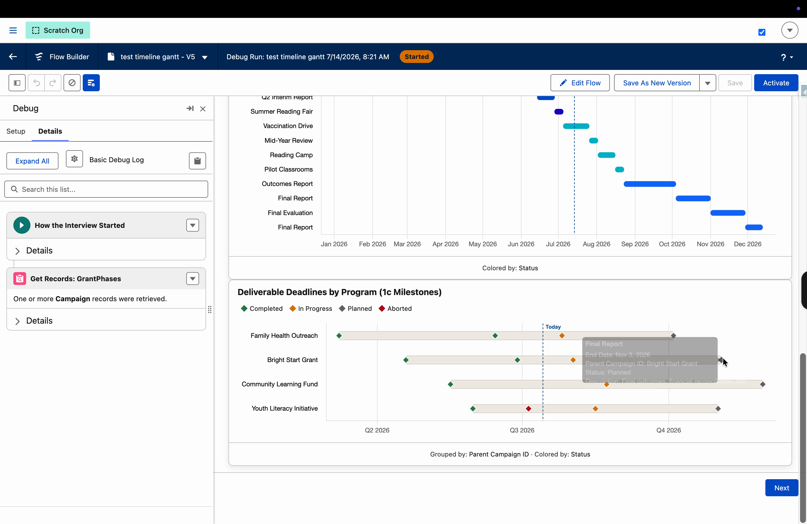
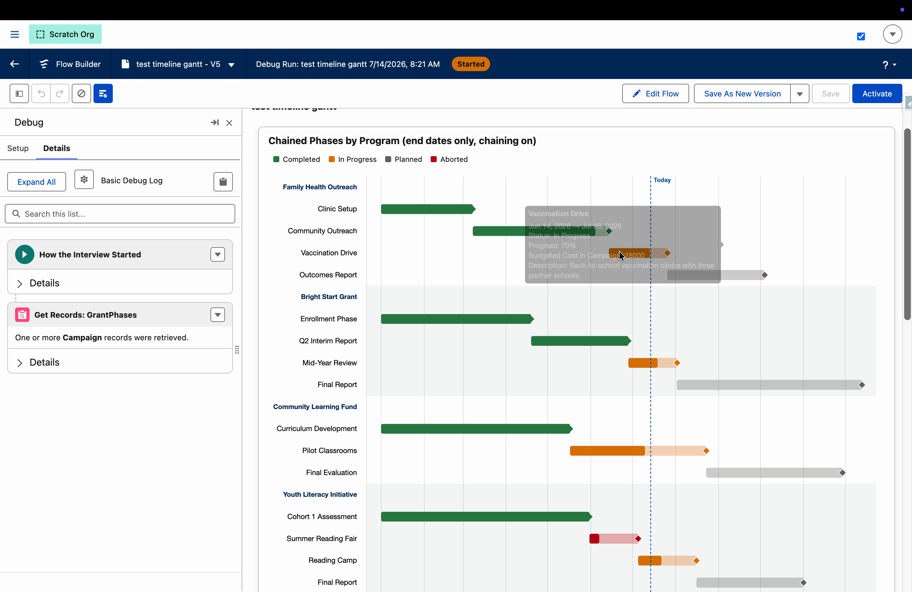
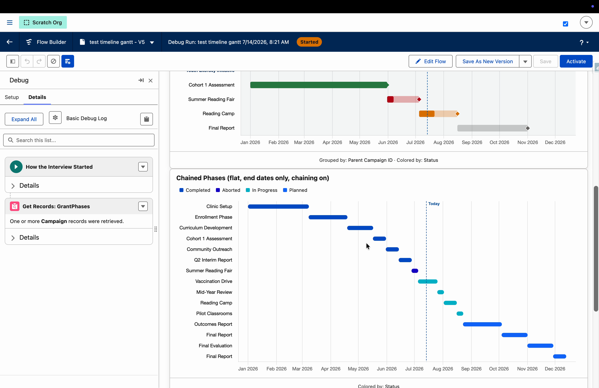
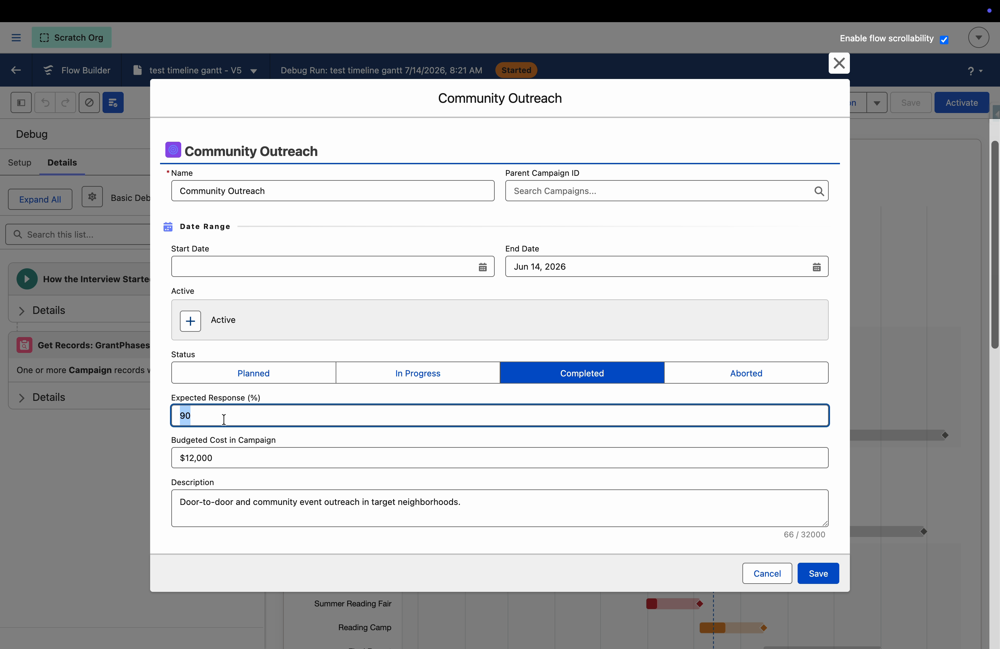

# Timeline (Gantt) Chart Type

Renders records as **date-range bars** and **milestone diamonds** on a time axis - one row per record or one row per group. Built for schedules: grant deliverables, program phases, opportunity pipelines, volunteer shifts, project plans.

## Purpose and unique features

The timeline answers "**when**" the way the other chart types answer "how much per bucket." What makes it different from a standalone Gantt tool:

- **It lives on a Flow screen.** Filters, grouping choices, and drill-down logic stay in Flow where admins already work; the chart re-renders reactively as upstream collections change.
- **Partial dates still render a schedule.** Records missing a start date automatically continue from the previous record's end (sequencing by collection order), and admin-set default dates fill remaining gaps. Deadline-only data becomes a real timeline.
- **Click a record, edit it in a modal.** With [Record Form on Click](CPE_REFERENCE.md#record-form-on-click), any single-record element opens a FlowToolKit Form; saves re-render the chart immediately and emit an update collection for your Flow to persist. No DML happens inside the component.
- **Everything resolves to human labels.** Lookups (including custom ones) show record names, picklists show translated labels, and tooltips carry any extra fields you name.

What it is not: a project-management Gantt. No dependency arrows, no drag-to-reschedule, no critical path, no collapsible task trees. The implicit sequencing that chaining provides (each phase starts when the previous one ends) covers the most common "dependency" need without any of that machinery.

---

## The three configurations

One chart type covers three layouts. The mode is inferred from two fields:

| Mode | Row Label Field | Group By Field | What renders |
|---|---|---|---|
| **Flat list** | set | blank | One row per record, in collection order. Best for compact dashboards. |
| **Grouped swimlanes** | set | set | One row per record under bold group header rows with alternating background bands. |
| **Grouped milestones** | blank | set | **One row per group.** Each record becomes a milestone diamond on its group's row, with a neutral period bar behind them. |

---

## Parameter reference and configuration considerations

The property editor groups the timeline mapping the same way this section does.

### Rows and Grouping

| Parameter | Expects | Considerations |
|---|---|---|
| **Row Label Field** | Any field | The y-axis label per record. Lookups resolve to record names; picklists show translated labels. **Leaving it blank while Group By is set switches to grouped-milestones mode.** Duplicate labels are allowed (rows are positional). |
| **Group By Field** | Lookup, Picklist, Text, Checkbox | With Row Label: bold swimlane headers with alternating bands. Without: one row per group. Groups appear in first-appearance order, so the upstream Sort decides both group order and the chaining sequence inside each group. |

### Bar Dates

| Parameter | Expects | Considerations |
|---|---|---|
| **Start Date Field** | Date or Datetime | Where each bar begins. A record with a blank value **chains**: it starts where the previous record in its group ended. Explicit values always win, and the chain resumes from their end. |
| **End Date Field** | Date or Datetime | Where each bar ends. This is the anchor of the whole ladder - chaining advances from resolved ends, so end-dates-only data is a fully valid configuration. |
| **Default Start Date** | Date value or Flow date variable | Two jobs: the chain's anchor (each group's first record starts here when it has no start of its own) and the plain fallback for missing starts. Bind it dynamically - a grant award date, a fiscal-year start, a formula. |
| **Default End Date** | Date value or Flow date variable | Fallback for records with no end date. Use sparingly: every dateless record gets the same invented end, which can read as real schedule data. |

### Milestones

| Parameter | Expects | Considerations |
|---|---|---|
| **Milestone Date Field** | Date or Datetime | A diamond per record - e.g., a due date. Works with or without bars; in grouped-milestones mode this is the main event. |
| **End Date Markers** | Toggle | A diamond at the end of every bar, colored like its bar. Only offered once Start/End fields are set. Good for emphasizing deadlines on swimlanes. |

### Color and Progress

| Parameter | Expects | Considerations |
|---|---|---|
| **Color By Field** | Picklist (best), Text, Checkbox, Lookup | Colors bars (bar modes) or diamonds (grouped milestones) per value. Default mode auto-assigns a brand palette; Per Grouping mode gives exact value-to-color control and keys off this field. Multi-select picklists treat each combination ("A;B") as one literal value. |
| **Progress Field** | Percent or Number | Fills each bar proportionally in the full color over a lighter track. Salesforce Percent literals (0-100) and 0-1 ratios both work. |

### Axis and Tooltips

| Parameter | Expects | Considerations |
|---|---|---|
| **Axis Scale** | Auto / Week / Month / Quarter / Year | Tick granularity. Auto fits the data span; pick Quarter for grant-cycle framing ("Q3 2026"). Multi-year data labels disambiguate automatically. |
| **Tooltip Fields** | Comma-separated field API names | Extra hover lines - Description, Amount, Owner. Long text wraps. Dates format to the viewer's locale. |

### Appearance (shared sections)

| Option | Considerations |
|---|---|
| **Density** | Comfortable (default) or Compact (thin pill bars, tighter rows). Chart height scales with row count automatically, capped at 900px. |
| **Today Line** | Dashed marker at the current date, on by default; the axis extends to include today. Turn it off for purely historical views. |
| **Legend** | Color By values as chips above the canvas: squares for bar colors, diamonds for milestone colors. |

---

## Partial dates: the fallback ladder

Real data rarely carries both dates on every record. Each record's bar resolves through a ladder, and explicit values always win:

1. **Start**: the Start Date Field value → the previous record's resolved end within the same group (**chaining**) → the Default Start Date → no bar.
2. **End**: the End Date Field value → the Default End Date → no bar.

Chaining is what turns deadline-only data into a schedule: sort the collection by due date, set a Default Start Date as the anchor, and each phase's bar runs from the previous deadline to its own. Every group chains independently, so each Funding Request's phases form their own sequence. A record whose chained start would land after its own end renders no bar (its milestone still shows), and records that resolve no dates at all are skipped exactly as before.

---

## Recipes: parameter combinations

Six proven combinations. Source Records and the mode fields do most of the work; everything else is seasoning.

| Recipe | Row Label | Group By | Start / End | Milestone | Notable extras |
|---|---|---|---|---|---|
| Grouped milestones (grantmaking) | blank | parent lookup | optional (period bars) | due date | Color By type/status, Axis Scale Quarter |
| Swimlane phases | Name | parent lookup | set | blank | Progress Field, End Date Markers, Today Line |
| Deadline-only chained schedule | Name | parent lookup | End only | blank | Default Start Date anchor; sort by end date |
| Compact dashboard strip | Name | blank | set or End only | blank | Density Compact, Limit |
| Milestone-only flat list | Name | blank | blank | date field | Color By status |
| Bars plus mid-bar milestones | Name | optional | set | review date | Both marks per record |

### Grouped milestones - deliverable deadlines by program

Group By = parent lookup, Milestone Date = due date, Color By = status or type, Axis Scale = Quarter. Each parent is a row; its records are diamonds. The neutral period bar spans the earliest-to-latest dates found on the group's records (map formula fields copying the parent's dates for exact periods).

### Swimlane phases - with chaining, progress, and end markers

Row Label = Name, Group By = parent lookup, End Date Field set, Default Start Date as the anchor. Records missing starts chain off the previous phase. Progress Field fills the bars; End Date Markers put a diamond on every deadline.

### Compact dashboard strip

Row Label = Name, no grouping, Density = Compact. One flat sequence in collection order - here the same deadline-only data chained into a single strip.

### Deadline-only chained schedule

The client case this was built for: records that only have due dates. End Date Field = the due date, sort the collection by it, set Default Start Date (bind it to the award date), leave Start Date Field blank or map it for the records that have one. See "Partial dates" above.

### Milestone-only flat list

Row Label = Name, Milestone Date = the date, nothing else. One diamond per record - a lightweight deadline board.

### Bars plus mid-bar milestones

Map Start/End *and* a Milestone Date (e.g., a mid-phase review date). Each row gets its bar and an independently positioned diamond.

---

## Edit records from the chart

With **Record Form on Click** enabled, clicking any single-record element (a diamond, or a bar in row-per-record mode) opens that record in a FlowToolKit Form modal. Save re-renders the chart in place - the bar moves, the color changes - and the edits emit through `updateCollection` / `hasRecordsForUpdate` for **your Flow** to save. The form source follows the flowForm pattern: a picked Form, a per-record field value, or an inline JSON form. Full reference: [Record Form on Click](CPE_REFERENCE.md#record-form-on-click); wiring recipe: [Click a record, edit it in a modal](RECIPES.md#click-a-record-edit-it-in-a-modal).

---

## Data that works best

The timeline is object-agnostic - it only cares that records carry the right *field types*. In practice:

### Great fits

| Data shape | Example objects | Suggested mapping |
|---|---|---|
| **Records with a real start and end date** | Campaign (`StartDate` / `EndDate`), Contract, custom Project / Program / Grant Period objects | Bars per record. Color by Status. Progress from a Percent field. |
| **Child deliverables with a due date, grouped by parent** | Outbound Funds **Requirements** (`Due Date`) under **Funding Requests**; custom Deliverable / Report / Task objects under a parent | Grouped milestones, or the deadline-only chained schedule. |
| **Phases within a program** | Child Campaigns under a parent Campaign (`ParentId`) | Swimlanes: Row Label = Name, Group By = ParentId, bars from Start/End, end-date markers on. |
| **Scheduled work** | V4S Shifts / Job Recurrence Schedules, service appointments, events | Bars from start/end Datetimes, grouped by job or resource. |

### Works with a caveat

| Data shape | Caveat |
|---|---|
| **Opportunities as bars** (`CreatedDate` to `CloseDate`) | `CreatedDate` isn't writable, so this only demos meaningfully on *aged* data - in a fresh sandbox every bar starts "today." Real orgs are fine. `CloseDate` alone as a milestone (or with chaining) works everywhere. |
| **Datetime fields** | Values are placed on the user's *local* calendar day. A due datetime of 11 PM stays on its day for that user, but users in other timezones may see the diamond one day over - normal Salesforce behavior. |
| **Multi-select picklist as Color By** | Each *combination* ("A;B") is treated as one literal value with its own color. Usable, but a single-select picklist gives cleaner legends. |

### Skipped automatically

- A record that resolves no start or no end after the fallback ladder renders no bar (a milestone still renders if it has one). Records with nothing to plot are dropped from the chart.
- A resolved end before the resolved start → the bar is skipped rather than drawn backwards.
- Start equal to end → rendered as a minimal-width bar so single-day items stay visible.

---

## Example: filter by tags - in Flow, not in the chart

"Show only projects tagged Early Childhood" needs no chart configuration:

1. Add a **Choice picklist** screen component with the tag values.
2. Add a **Collection Filter** element (or reactive formula) upstream: Funding Request tag equals the choice - for multi-select picklist tags, use a *contains* condition (values store as `A;B;C`).
3. Point the chart's Source Records at the filtered collection.

The chart re-renders reactively as the user changes the picklist. The component stays object-agnostic; the filter logic stays where admins can see and change it.

---

## Interactions and outputs

Clicking a bar selects the records behind that row (the whole group in grouped-milestones mode); clicking a diamond selects that single record. Selections feed `selectedRecords`, `firstSelectedRecord`, `activeRecords`, and friends; record-form edits feed `updateCollection` / `updateCollectionSize` / `hasRecordsForUpdate` plus the `records` round-trip - see [Output Properties](OUTPUTS.md). `selectedDataValue` / `selectedPercent` don't apply to timelines and stay null.

**View Data** works unchanged - one click opens the active records in a Form Builder table modal (note the [data-table licensing callout](CPE_REFERENCE.md#view-data)).

## Sizing guidance

Height scales with rows (capped at 900px). Past ~25 rows the chart gets tall and scanning suffers - use **Limit** plus an upstream Sort, or filter upstream, rather than plotting hundreds of rows. See [Performance](PERFORMANCE.md) for general guidance.
